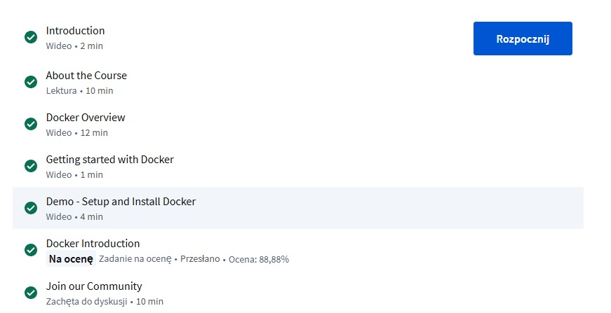
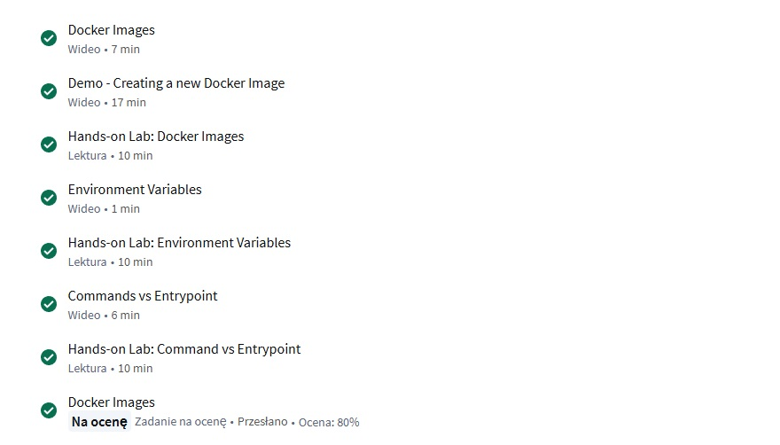
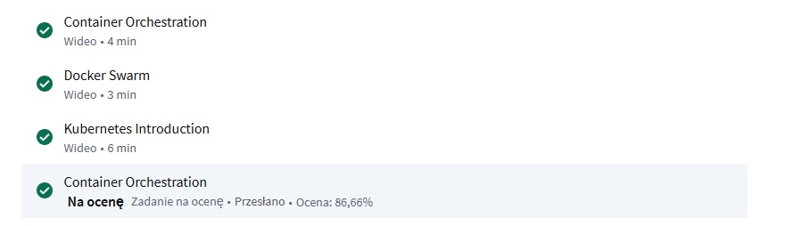
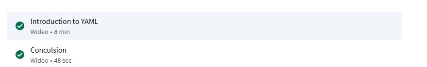
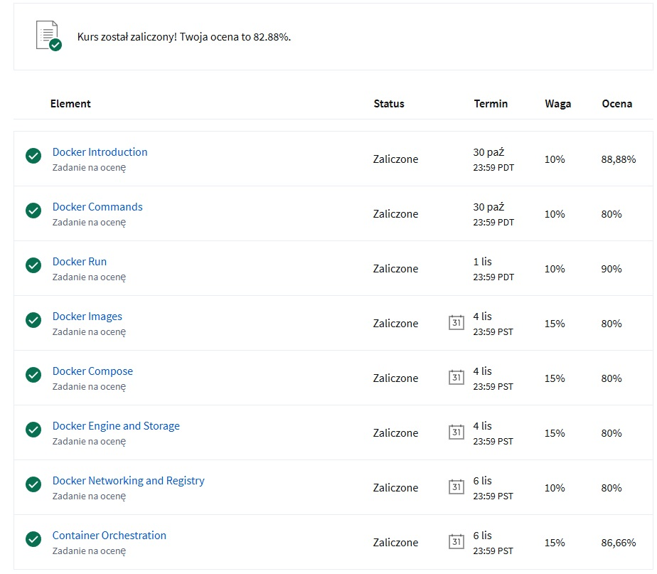

### Zrzuty ekranu
Wykonane moduły kursu:
Moduł 1:

Moduł 2:

Moduł 3:

Moduł 4:

Moduł 5:

Moduł 6:

Moduł 7:

Moduł 8:

Moduł 9:

Moduł 10:

Podsumowanie testów:

Więkrzość błędów to (moim zdaniem) głupoty jak wpisywanie kilku słów pod konkretny klucz