### Lab 2 Radosław Czuj

### Zrzuty ekranu

## 1.RUNNING CONTAINERS

1. Komenda `docker images`: 
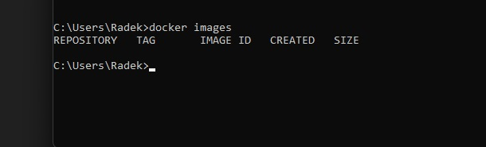

2. Komenda `docker search`: 
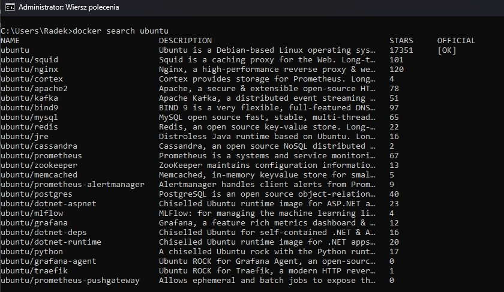

3. Komenda `docker pull`: 
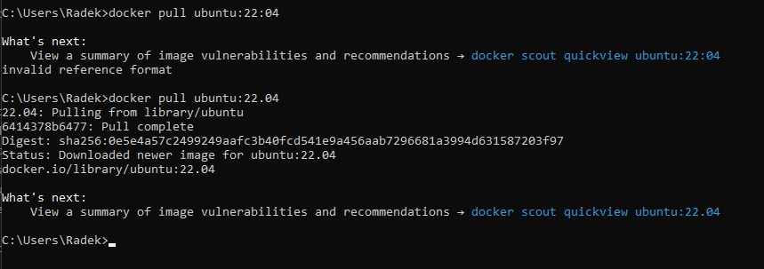

4. Komenda `docker pull` z tagiem: 
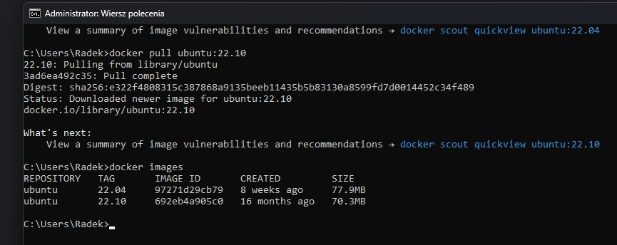

5. Komenda `docker rmi`: 
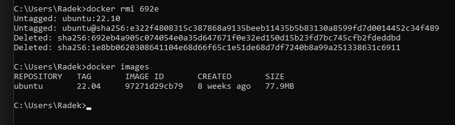

6. Komenda usunięcia wszystkich obrazów w windows power shell (wcześniejszy kurs robiłem na linuxie, więc teraz testowałem wariant dla windowsa): 
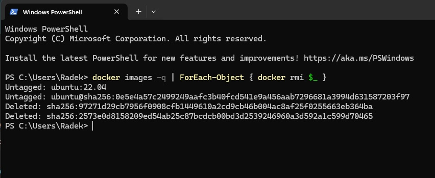

7. Komenda `docker run`:  
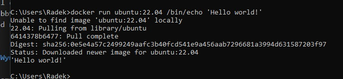

8. Komenda `docker ps`:  
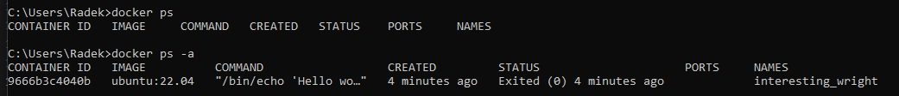

9. Komenda `docker run bin/bash`:  
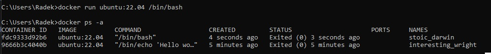

10. Komenda `docker run -it bin/bash`:  
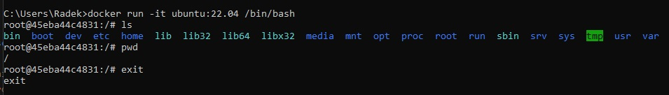

11. Komenda `docker run -d bin/bash/sleep 3600`:  
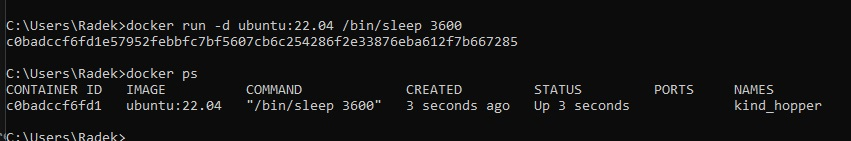

12. Komenda `docker exec`:  
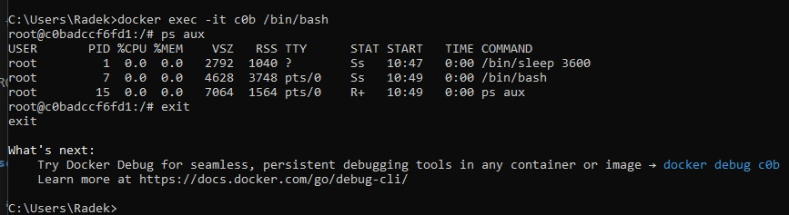

13. Komenda `docker ps dla exec`:  
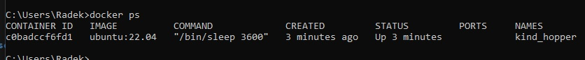

14. Komenda `docker stop`:  
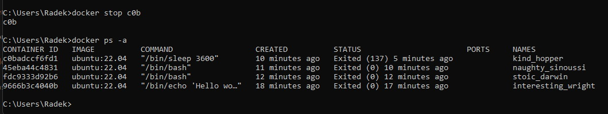

15. Komenda `docker rm`:  
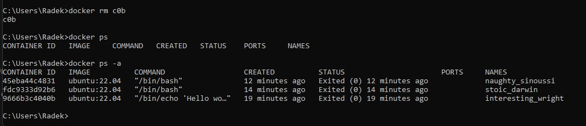

16. Komenda usuwania wszystkich kontenerów w windows power shell:  
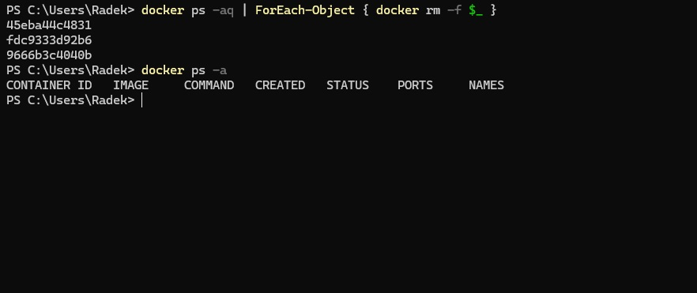

## 2.CHANGING IMAGES

1. Pull ubuntu: 
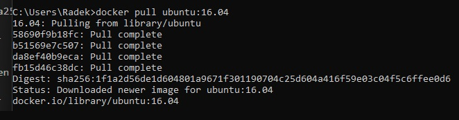

2. Komenda `run -it ubuntu` i pobranie komendy pinga:
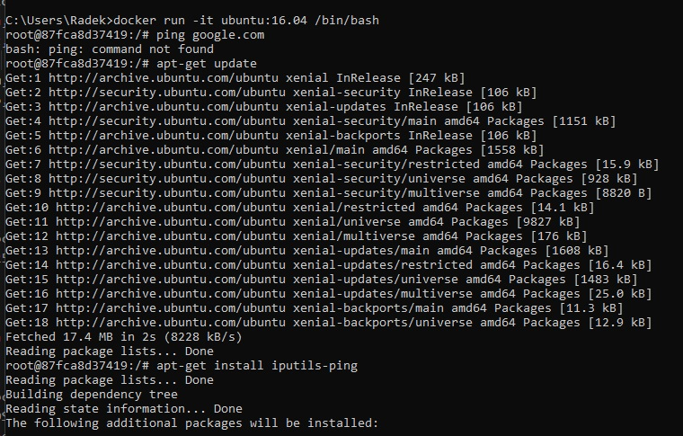

3. Ping:
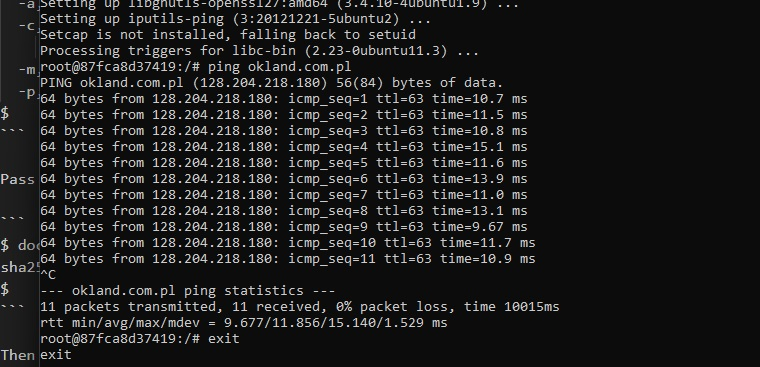

4. Docker ps -a:
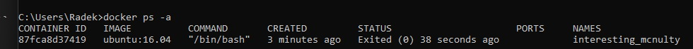

5. Docker commit:
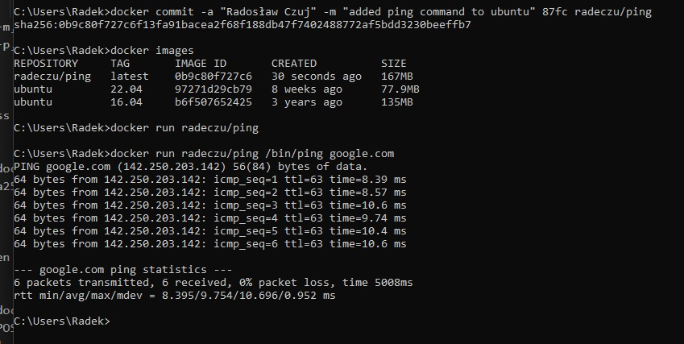

## 3.BUILDING IMAGES

1. Pierwszy `docker build`: 
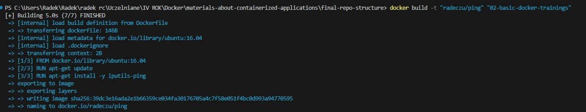

2. `docker images`:
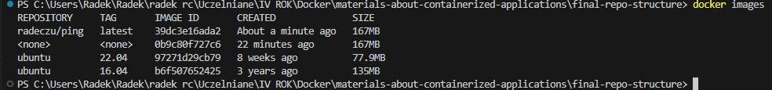

3. Drugi, leprzy `docker build`:
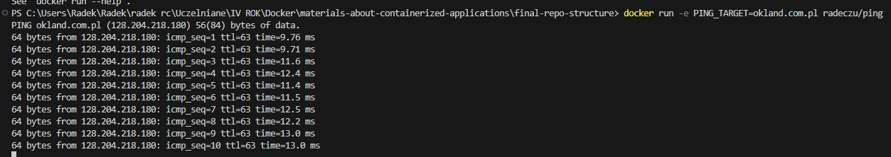

## 4.SHARING IMAGES

1. Czyszczenie: 

2. Retag: 

3. Push:

4. Dockerhub:

## 5.VOLUMES

1. Run apacha
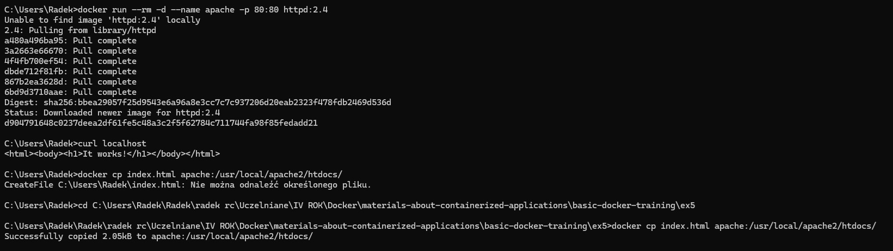

2. Edycja zawartości
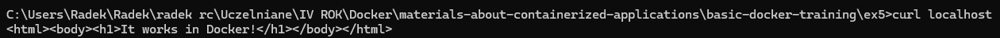

3. Tworzenie i usunięcie volume
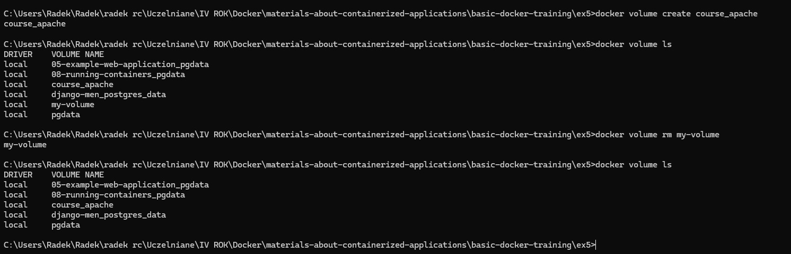

4. Persistant data with volume
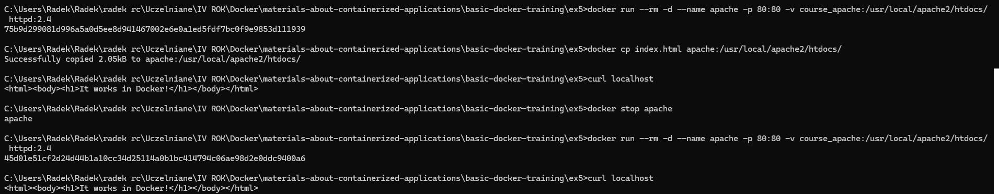

5. Próba zmountowania index.html z tego repo ale nie wyszło bo mam spacje w ścieżce. Rozumiem jak działa ta komenda
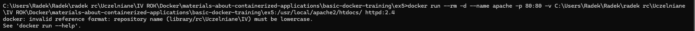

## 6.NETWORKING

Coś nie działało mi z konterenerami i się nie pokazywały po stworzeniu przy pomocy komend autora tego kursu
tylko network mogłem stworzyć.

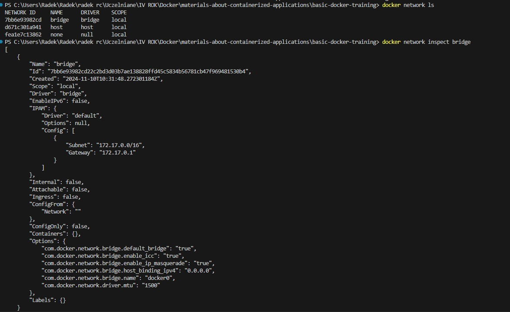
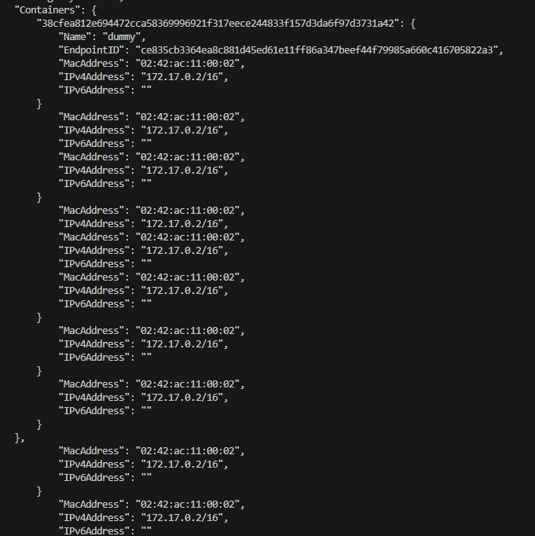
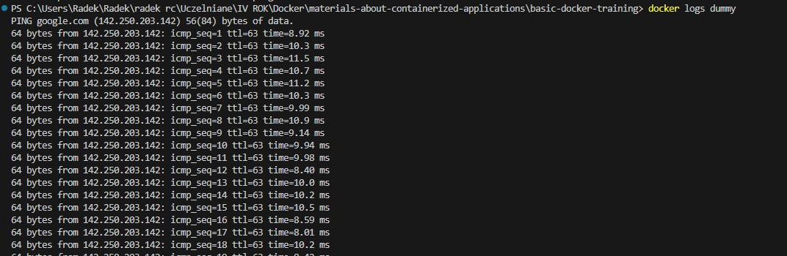
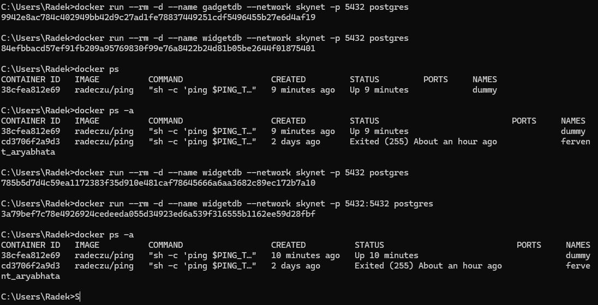
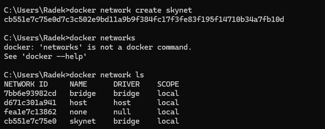
