### Hello, there :)

### Zrzuty ekranu

### LAB1:
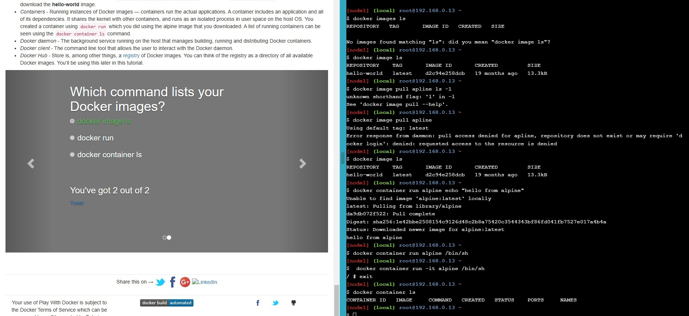

Pojedynczy screen z testu tego laba, gdyż wszystko w nim zawarte było już w poprzednich zajęciach

### LAB2:
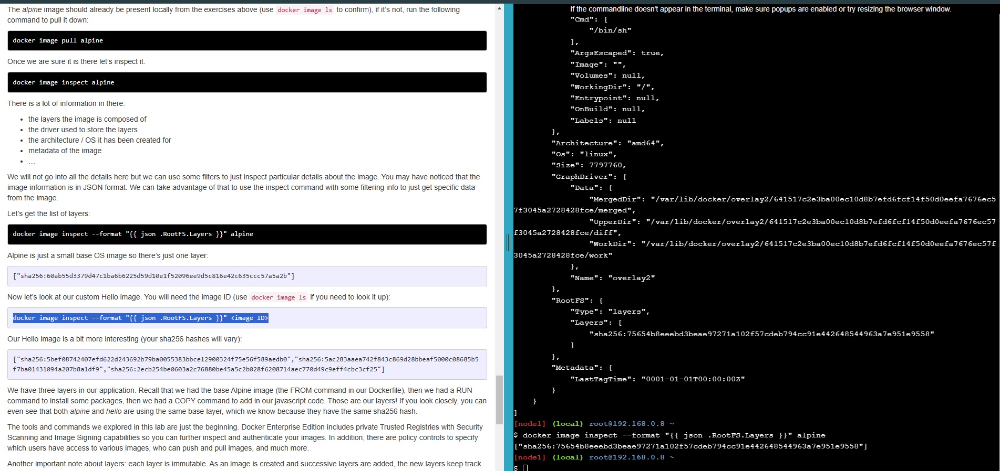

Wykonany LAB2, w środowisku przeglądarkowym jest problem z komendą `apt-get update`, dlatego zrobiłem co mogłem ale zawartość tego laba też już była.

### LAB3:
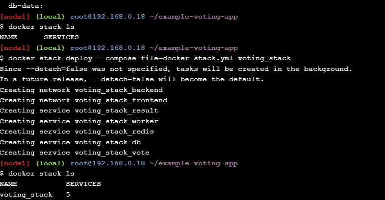

W labie 3 komendy stack i scale były nowe.

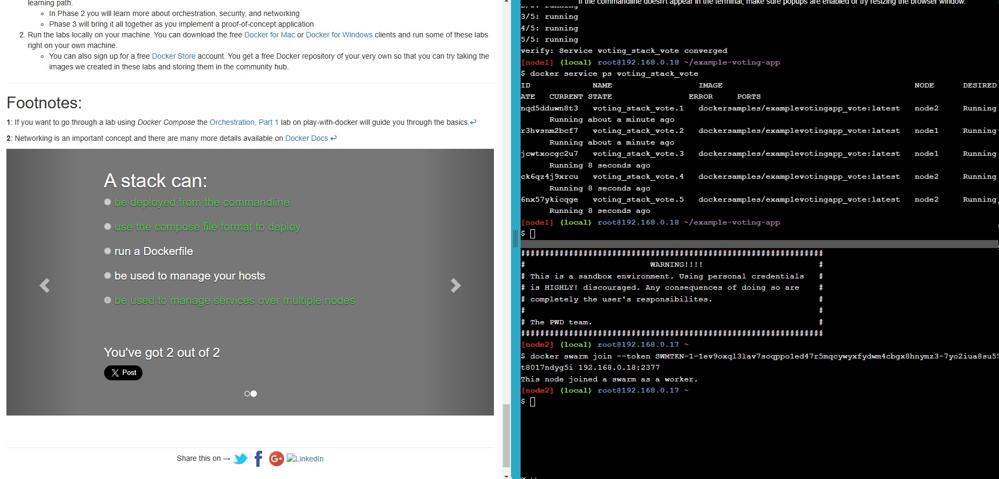

Zostały wykonane

### LAB4:

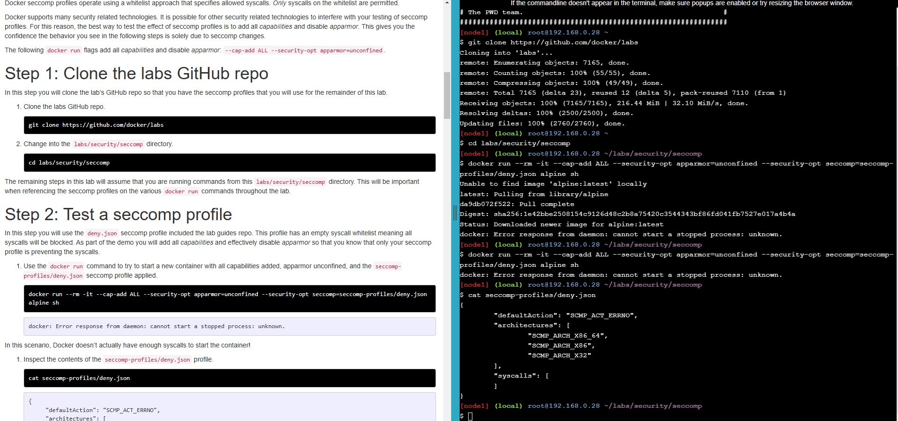

Sekcje 1 i 2, klonowanie repo oraz test podstawowy seccomp profile

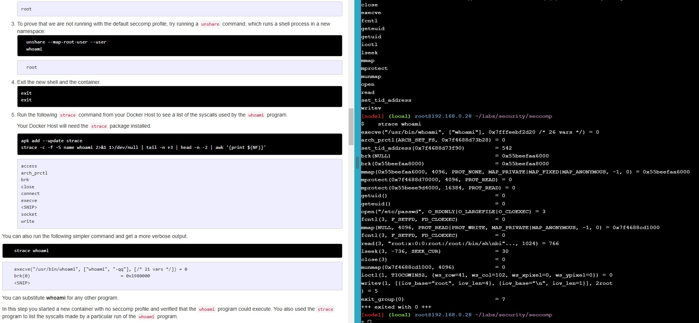

Wykonana sekcja 3 segmentu o seccomp. Seccomp służy do restrykcji konteneru, by nie zagrażał hostowi.

### LAB5:

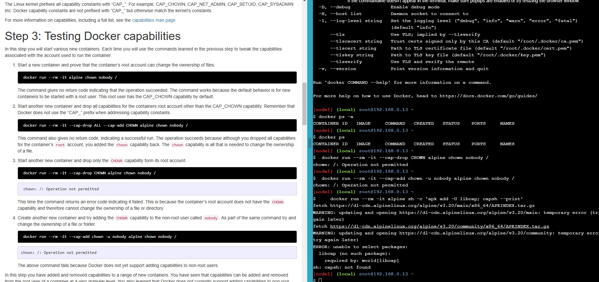

Capabilities służą do ograniczania użytkownika wewnątrz kontenera, by chronić kontener przed uprawnieniami root użytkownika.

### LAB6:

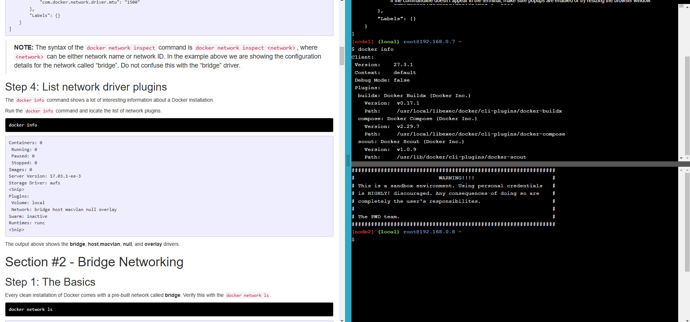

Wydaje mi się że powinno być użyte `docker network info`, by wyświetlić pluginy

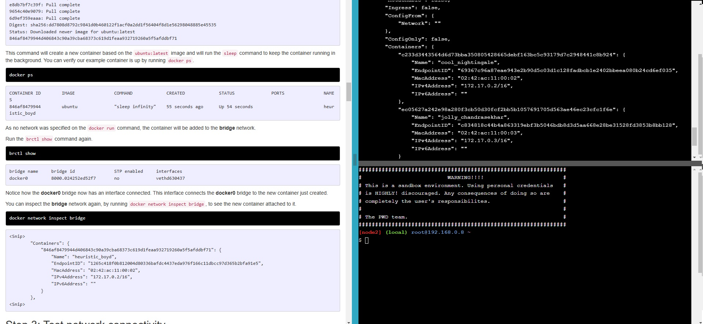

Kontenery autimatycznie łączą się z domyślnym bridgem na lokalnym adresie 172.17.0.01

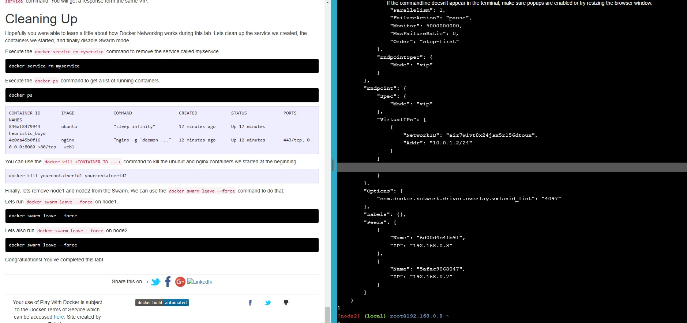

Część 3 polegała na stworzeniu sieci typu overlay razem z docker swarm. Teraz widzę, że screen nic zasadniczo nie pokazuje.

### LAB7:
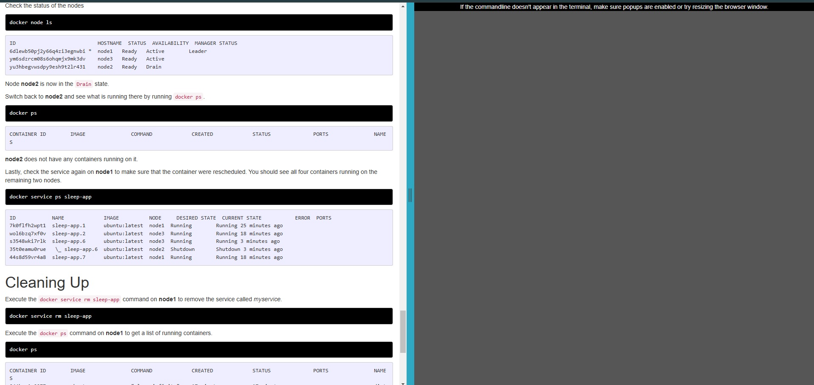

Niestety nie działał mi terminal po kilkudziesięciu odświerzeniach, więc ostatnią część mogłem tylko przeczytać.
Orkiestracja w ramach tgego laba to funkcja "services" w ramach docker swarm, umożliwiająca wszybkie skalowanie ilości usług w stosunku do potrzeb.

Nie znalazłem interaktywnych labów w trzeciej sekcji.