### Hello, there :)

źródło zadań:
https://devopswithdocker.com/part-1/

Z racji że to czwarty raz to samo jeśli chodzi o kursy, tym razem chciałem jak najwięcej robić w docker desktopie

### 1.1
Stworzenie trzech kontenerów i pokazanie ich
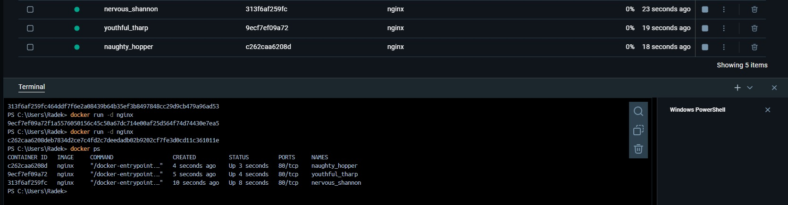
Zatrzymanie dwóch z nich
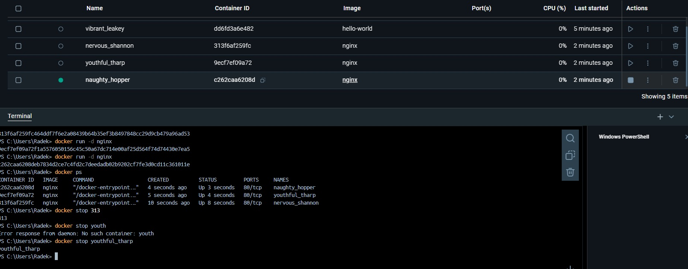

### 1.2:
`docker image ls` i `docker ps`
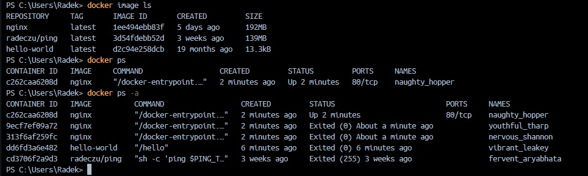
`docker ps -a`
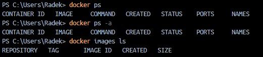
usuwanie wszystkich kontenerów
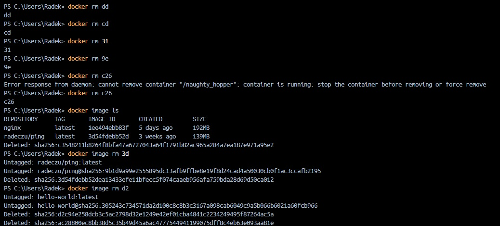

### 1.3:
detach + `docker exec`
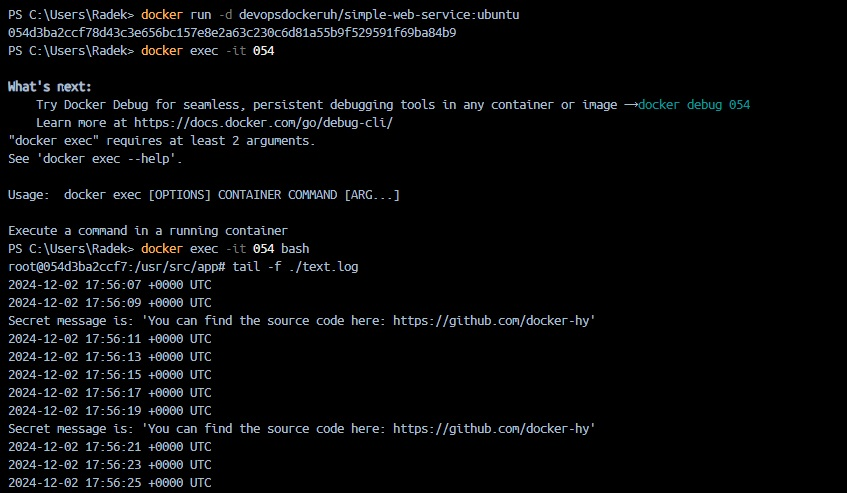

### 1.4:
instalowanie curla na kontenerze ubuntu
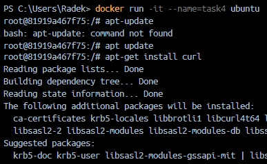
`docker exec` na kontenerze
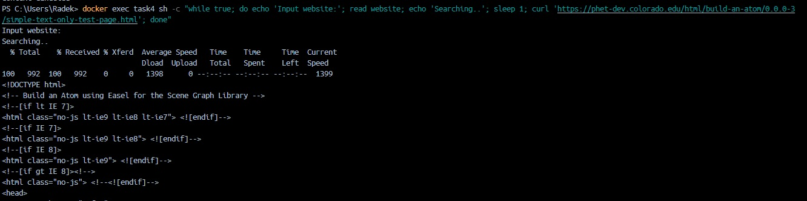

### 1.5:
zadanie z komendą tail i plikiem w środku kontenera
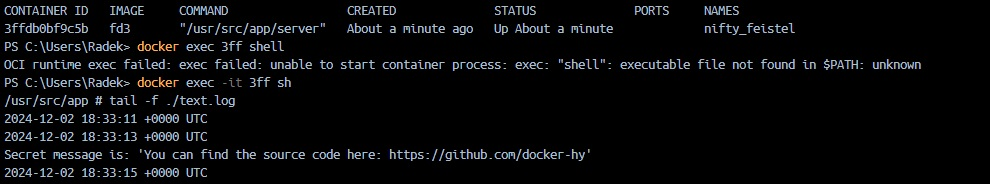

### 1.6:
zadanie "znajdź hasło w opisie na dockerhubie"
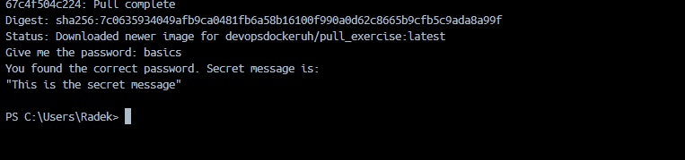

### 1.7:
Uruchomienie script.sh na konetenerze
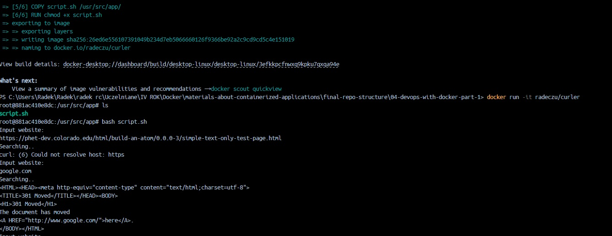

### 1.8:
`docker run -v`
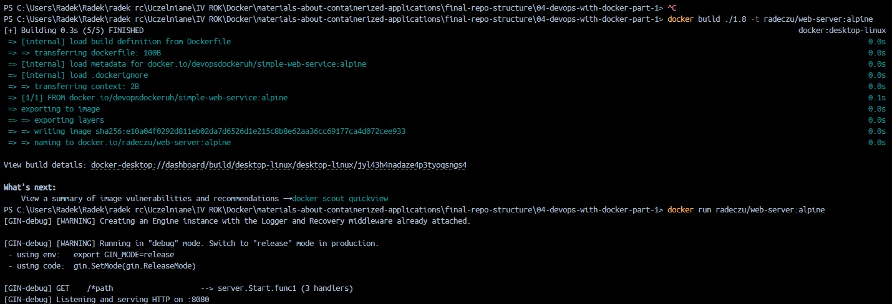
komenda użyta
docker run -v "$(Get-Location)/1.8/log/text.log:/usr/src/app/text.log" devopsdockeruh/simple-web-service

### 1.10:
Działający web service lokalnie
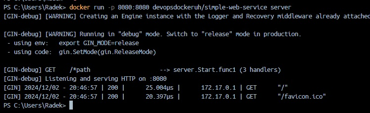

### 1.11:
Odpalenie projektu testowego lokalnie
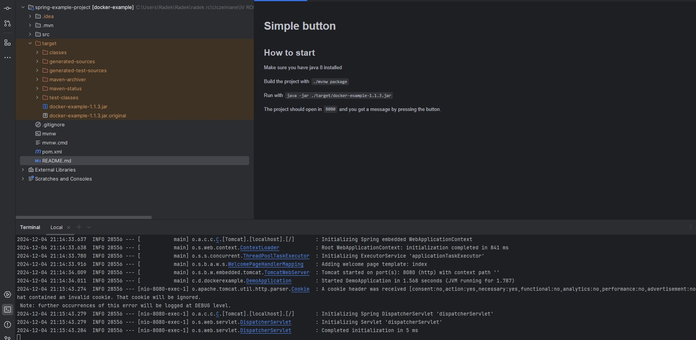
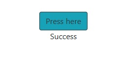

### 1.12:
Działający frontend poprzez kontener
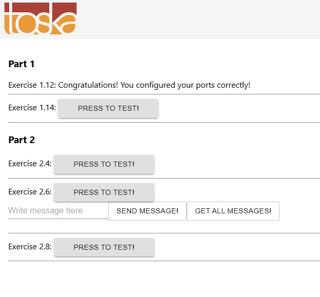

### 1.13:
Działający backend poprzez kontener przyjmujący połączenia
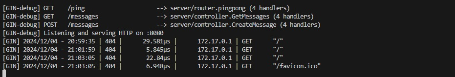

### 1.14:

miał być ping poprzez zmienne środowiskowe reacta
to nie działa

brak pomysłu dlaczego z mojej strony

docker run -e PORT=8080 -e REQUEST_ORIGIN=http://localhost:5000 -p 8080:8080 radeczu/backend

docker run -e REACT_APP_BACKEND_URL=http://localhost:8080 -p 5000:5000 radeczu/frontend

pingpong.js:

`
  import axios from 'axios'

  const baseURL = process.env.REACT_APP_BACKEND_URL || '/api'

  export const axiosInstance = axios.create({ baseURL })

  /**
  * This can be used to check that frontend has access to backend
  */
  export const pingpong = () => axiosInstance.get("/ping")
`

Defaultuje do /api zawsze, więc apka frontend się nie łączy do backendowej jakkolwiek ustawił bym wcześniej te envy

