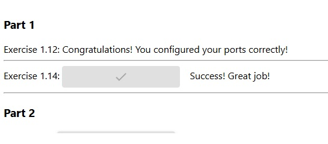
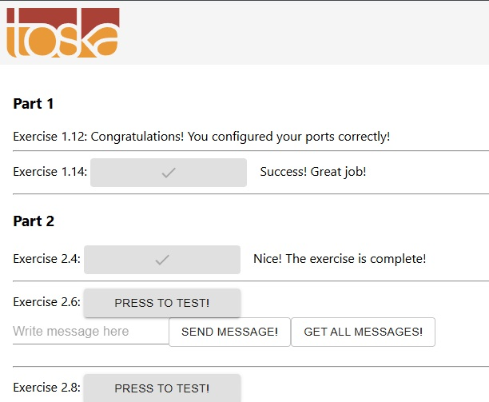
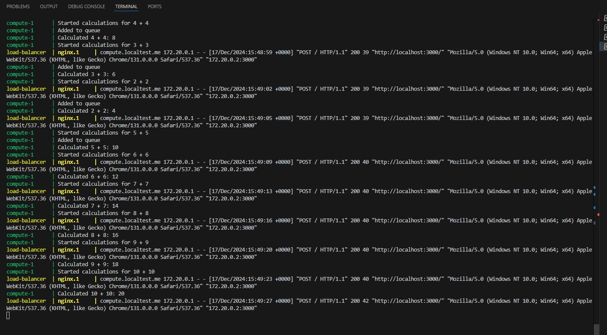
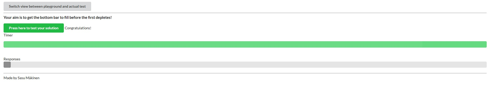
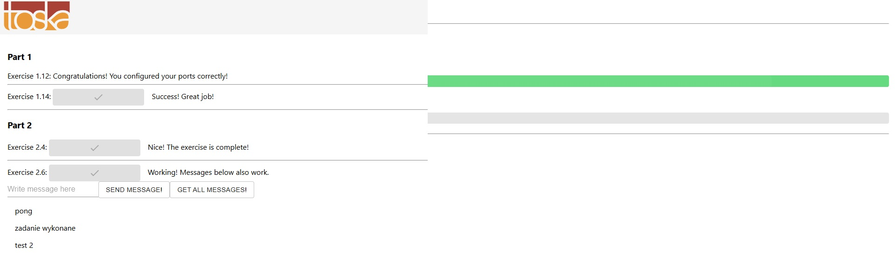
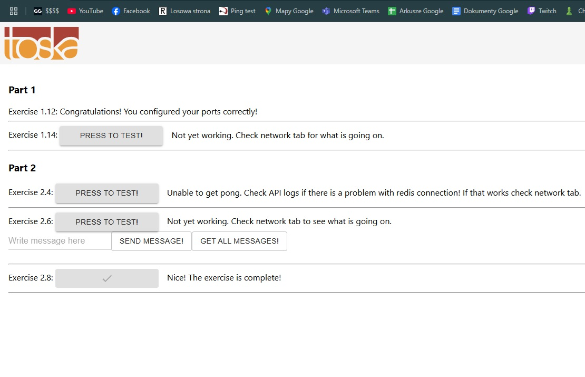
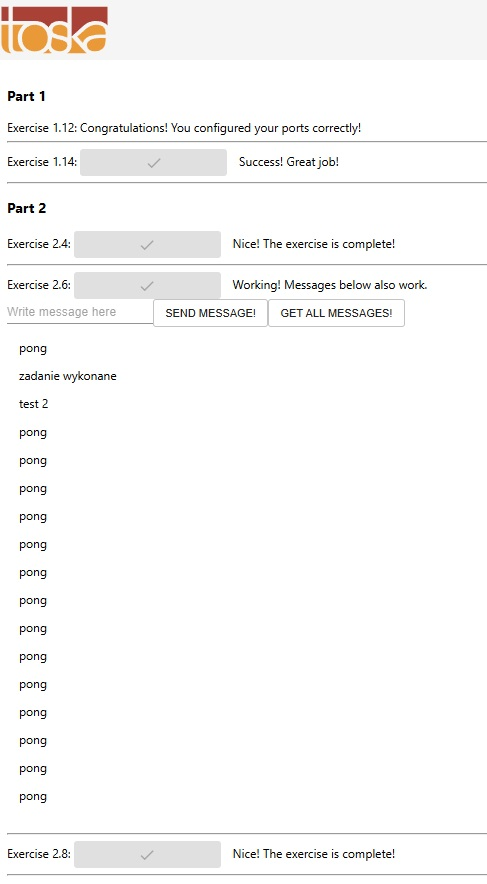
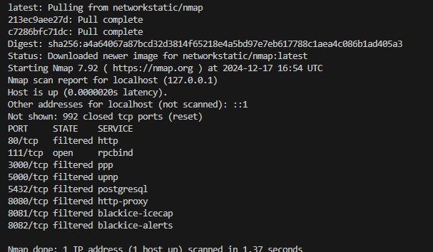

### Hello, there :)

### Devops with docker, część 2

Udało mi się naprawić usługi z ćwiczenia 1.14, wcześniej kod nie łapał zmiennej środowiskowej, ale dodałem ją jako 
ARG REACT_APP_BACKEND_URL
ENV REACT_APP_BACKEND_URL=${REACT_APP_BACKEND_URL}
i zadziałało

Zadanie 2.4 wykonane, wszystkie zadania są łącznie widoczne w docker-compose.yml tego laba

Uruchomiłem to co zostało dodane do zadania 2.5

Wynik pokazał mi się jako poprawny i nie wiem do końca jaki był cel tego ćwiczenia, spodziewałem się, że będe musiał coś zmienić

Dodany Redis

Dodany Postgres

Uruchomiony serwis proxy w nginx

Polecenie miało polegać na wyłączeniu wolnego dostępu przez porty usług które nie są nginxem na froncie projektu.
Nie jestem pewien czego oczekuje autor. Nie wykonałem go w pełni, ale uważam, że jest wykonalne przy ponocy sieci w ramach dokera a nie localhosta.

