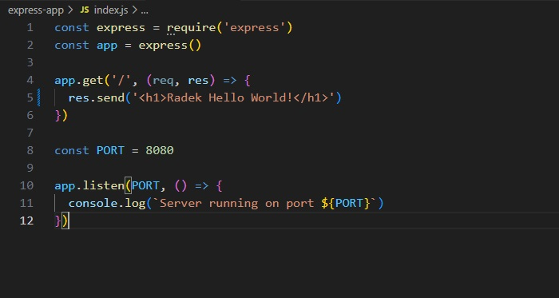
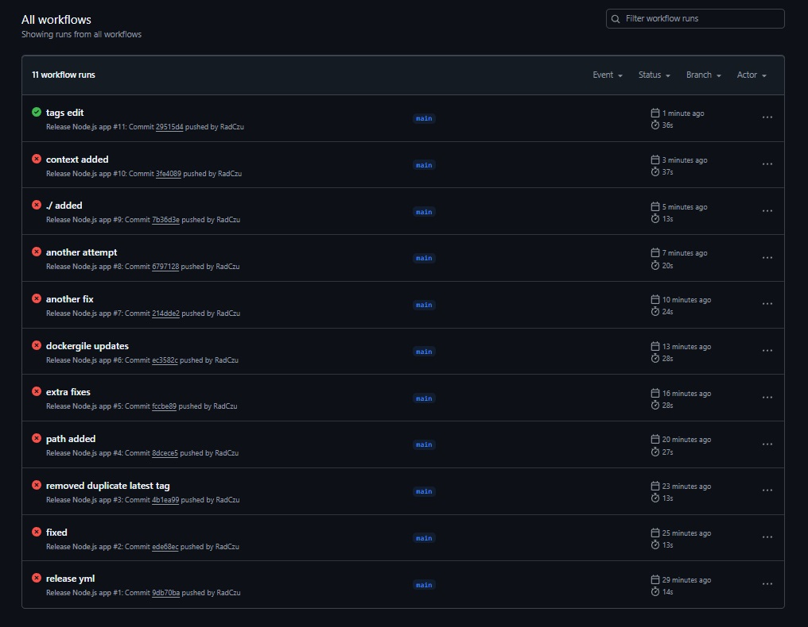
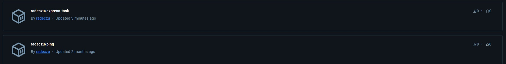
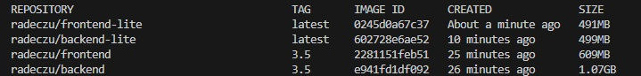
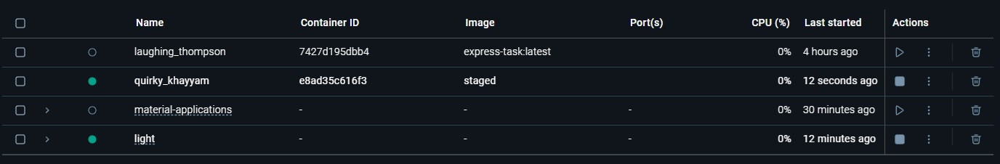
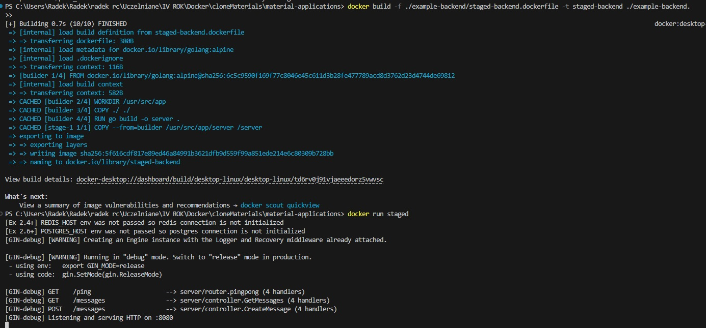
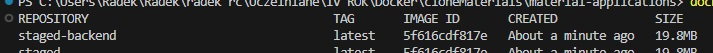

### Hello, there :)

### Część 3 Devops with docker.

### 3.1
Dokonałem prostej zmiany w kodzie.

Po kilkunastu konfiguracjach plików udało mi się wykonać działającą wersję.
Plik .yml jest w folderze 3.1

Stworzony poprzez commit na githubaobraz na dockerhubie.

Niestety pominąłem zadania 3.2-3.4, ze względu na to ile wymagają setupu z obcymi repozytoriami.

Edycja do zadanie 3.5 jest w folderze src
Sprowadza się do:
`
RUN useradd -m appuser
USER appuser
`

Zadanie 3.7. Udało mi się zmniejszyć rozmiar kontenerów o połowę za pomocą obrazów alpine.
Dockerfile tego zadania są w folderze shrunk-src

Zadanie 3.8 to włączony pojedynczy kontener frontendu z samym skompilowanym programem.
Pliki zadań 3.8-3.10 są w folderze staged-src.

Zadanie 3.9-3.10 to zmniejszenie kontenera backendu do 20mb.

